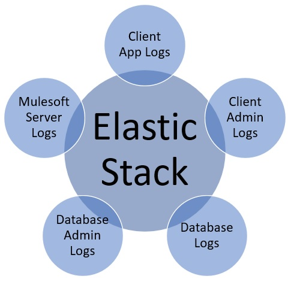
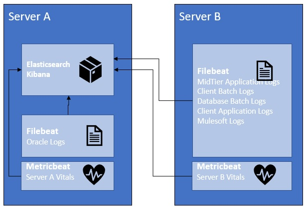
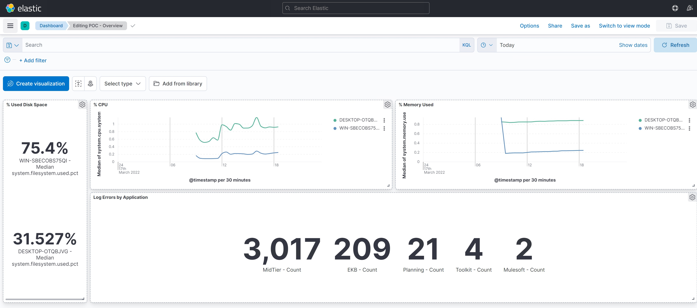
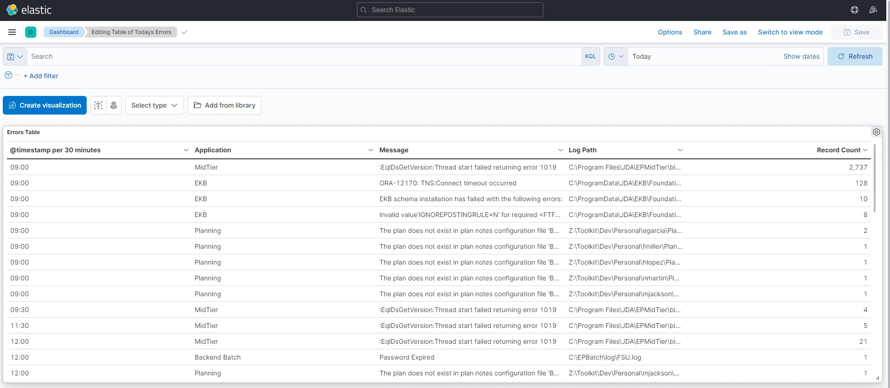
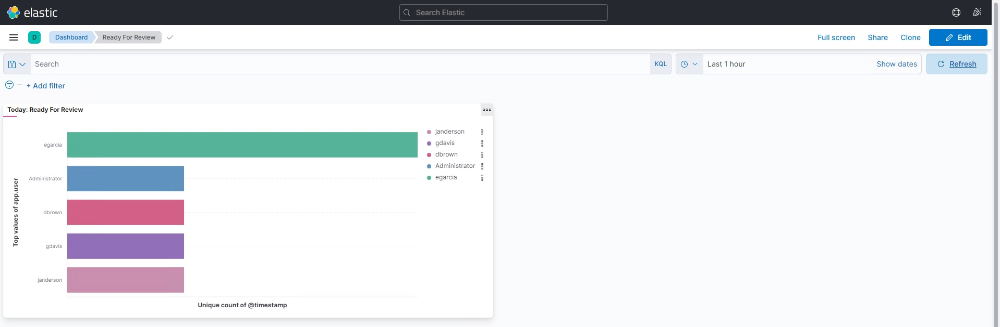

# Managing logs in legacy environments  <p>
## Overview  <p>
I have been implementing a back-office Merchandise Planning system for 20+ years now. You can imagine it has gone through quite a few revisions in that time. It is a fairly standard 3 tier architecture with an Oracle database backend, mid-tier application server, and the client front end. As much as I have grown to love this application, the logging in this landscape has become tricky due to <li>Number of applications <li> No standard location <li> No standard format of the logs.  <p>

All the logs I work with have a fixed layout and will vary in the location where they will log.  So, when something goes wrong, I'm checking my cheat sheets to find which servers are involved and which directories hold these logs. So many articles are born from recognizing a problem and the desire to share insights and findings with the hope someone out there in the community can learn and benifit from others. Which is the purpose of this prject.  <p>

Welcome to the Elastic Stack!  These free open source products from Elastic can reliably and securely take data from any source, in any format, then search, analyze, and visualize it in real time.  Perfect for system monitoring.  <p>

There are some considerations needed to determine what your stack will be.  For me, I don't necessarily need to do heavy transformations of the data.  So I opted to not use Logstash which has a lot of data transformation functionality but can be CPU and memory heavy.  Instead I use Filebeat which is defined as a "lightweight shipper to extract, parse, and load logs".  Note:  Filebeats *parses* logs.  It does not *transform* them.  This is an important consideration if your logs require a lot of transformation.  <p>

A very simple environment in my work consists of:
- Elastic Stack (ES) Server
- Database Server
- Mulesoft Server
- MidTier Application Server(s)
- Administrator/Batch Server(s)
- Client Application Server(s)
  
Regardless of which physical server the logs reside on, The information flows between the server roles as follows:



The main Elastic products I'm working with are:
* Elasticsearch:  A no sql database
* Kibana: Sits on Elasticsearch to provide search and data visualization capabilities
* Beats:
  * Filebeat: A lightweight shipper to extract, parse, and load file data to Elasticsearch
  * Metricbeat:  A lightweight shipper to collect server metrics (i.e. cpu and memory usuage) and load into Elasticsearch  <p>

## Configuration

For demonstration purposes, I will have two servers.  Server A is a Windows 10 physical server.  Server B is a Windows 2016 Server Virtual Machine running as a guest on Server A.  <p>

The elastic components communicate as follows:

  <p>

### Server A
For the Elasticsearch, Kibana, and Filebeat setup I opted to use Docker containers.  <p>  <b>docker-compose.yml</b>:  This will build the Docker containers for Elasticsearch, Kibana, and Filebeat.  The build will reference the Docker files and *.yml files as well.

For Metricbeats on Server A, I did a regular download/install of the Metricbeats.msi file from Elastic.  This used the metricbeat.yml in this project.

### Server B
For Metricbeats and Filebeats on Server B, I did a regular download/install from Elastic.  I have included metricbeat.yml and filebeat.yml configuration files here as well.

Depending on your specific setup, you will have to modify the yml configurations as appropriate.

## Configuration Highlights

Just a few things to point out that required additional attention for the setup:
* If using Docker:
  * Make sure to use volumes that map back to host for all the directories that still need to persist if the container is recreated
  * Lots of examples show how to use volumes to map <u>files</u> when the host system is Unix.  This won't work if your host system is Windows.  You can only map directories.  This seemed prevalent for mapping the yml files.  I put the yml files in a volume on the host and mapped that volume.
* I used the dissect command to parse the log lines into fields I used consistently for all the logs.
* I opted to use a consistent set of fields in all my logs (the fields start with "app.*").  I haven't moved completly to the Elastic Common Schema (ECS) yet.
  
### Pipelines
* I used Elastic Pipelines to do some minor transformations.  For example, one of the logs has an unconventional time date stamp of: 

```
Mar 10 08:20:35.683 2022
```
Filebeats sent the parts of this as tmpMonth tmpDay app.time tmpYear

I then created a pipeline (and referenced it in the Filebeats yml) which just transforms the tmpMonth tmpDay, tmpYear to a date field and then does some clean up:

```Groovy
{
  "log-helper-pipeline" : {
    "description" : "log-helper-pipeline",
    "processors" : [
      {
        "set" : {
          "field" : "tmpdate2",
          "value" : "{{tmpMonth}} {{tmpDay}}, {{tmpYear}}",
          "if" : "ctx?.app?.application == 'MidTier'"
        }
      },
      {
        "date" : {
          "field" : "tmpdate2",
          "formats" : [
            "MMM dd, yyyy"
          ],
          "target_field" : "app.date",
          "if" : "ctx?.app?.application == 'MidTier'"
        }
      },
      {
        "remove" : {
          "field" : [
            "tmpYear",
            "tmpMonth",
            "tmpDay"
          ],
          "if" : "ctx?.app?.application == 'MidTier'"
        }
      },
      {
        "remove" : {
          "field" : "tmpdate2",
          "if" : "ctx?.app?.application == 'MidTier'"
        }
      }
    ]
  }
}
```

## Dashboards

After all the configuration is completed and logs and metrics are being sent to Elasticsearch, we can use Kibana to setup some dashboards to review the data and moniotr your systems.  This is a simple dashboard, but it illustrates how a Systems Admin can see which areas are having problems:

High Level Error Stats:
  

Error Messages:
  


Additionally, Business Admins can also setup dashboards to view user activity based on user specific logs.  For example this dashboard shows which users have performed a particular activity ("Ready For Review") in the application today:

 
  
## Conclusion

Some last points that I just wanted to highlight:
  * Use the Docker Images as much as possible.  Keep it simple for yourself
  * If you don't need to do heavy transformation, skip using Logstash and try just using Filebeat or Elasticsearch pipelines
  * The dashboards don't have to just be just for system feedback. The dashboards can provide your users/business admins some feedback as well from the content of the logs.
